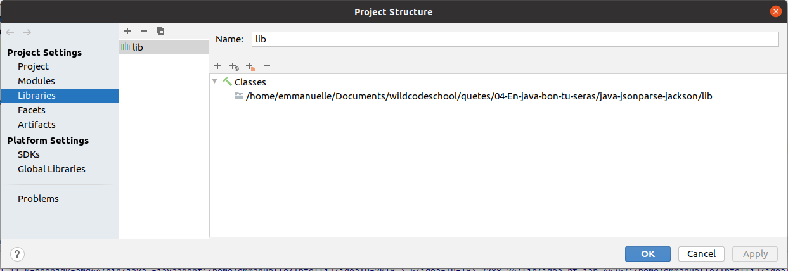

# Parser un JSON avec Jackson
## Parser un JSON avec Jackson

***Objectif***

    City name: London
    City latitude: 51.51
    City longitude: -0.13
    Wind infos: src.main.Wind{speed=4.1, deg=80.0}
    Weather infos: src.main.Weather{id=300, main='Drizzle', description='light intensity drizzle', icon='09d'}
    Weather infos: src.main.Weather{id=800, main='Clear', description='clear sky', icon='01n'}
